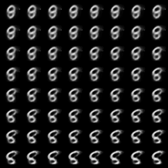

# VAE
This is an implementation of VAE for generating MNIST images.

I got some ideas from https://github.com/L1aoXingyu/pytorch-beginner/blob/master/08-AutoEncoder/Variational_autoencoder.py to write the code.

The advantage of VAE in comparison to GAN is its smoothness to generate the samples from the Gaussian noise

First train the model by running train.py

Then generate the samples by running test.py 

The weekness of VAE comparing to GAN is the quality of the images that are reconstructed. This issue can be improved by adding skip connections between encoder and decoder.
The loss function also can be change from MSE to BCE which helps to have a fast convergence.
